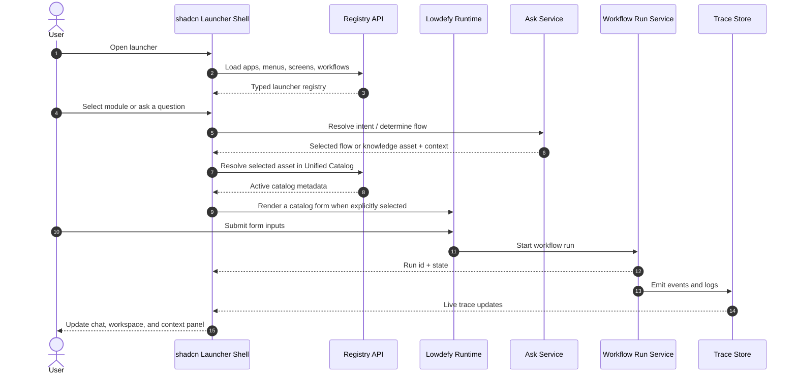

# Launcher Architecture

## Purpose

Describe the end-to-end launcher architecture after the stack decision change: a shadcn-based application shell with Lowdefy embedded only where dynamic YAML-driven rendering is valuable.

## Architecture Overview

The launcher is a **React + TypeScript + shadcn/ui shell** inside the monorepo. shadcn-admin is the visual and structural reference for the admin-style application experience, but the launcher should be implemented as our own app shell.

Lowdefy is still part of the architecture, but as a **dynamic rendering engine** for forms, flow screens, and module-specific declarative pages. It should not own the global layout.

The launcher must support three persistent work areas:

1. **Left navigation sidebar**: applications, modules, menus, submenus, admin, and settings.
2. **Center workspace**: chat-centered execution surface, active flow, form renderer, dashboards, and workflow canvas.
3. **Right context panel**: selected entity, flow, process, run, metadata, logs, actions, and related assets.

The left and right panels must be collapsible and resizable. The center workspace must remain usable while panels change size.

## Sources Of Truth

The launcher reads definitions and state from platform services, not from hardcoded React screens.

The runtime source of truth for the launcher is the Unified Catalog. AssetSet
YAML folders are version-controlled authoring and deployment inputs. They are
not queried directly by the browser and are not the production runtime source.

Neo4j is a specialized semantic projection used by Ask, retrieval, reasoning,
lineage, and impact analysis. It is not the launcher registry.

The ingestion and deployment pipeline writes assets to the Unified Catalog and
projects the asset types required by each knowledge base. Only validated assets
from an active AssetSet deployment are visible to the production launcher.

The UI should consume normalized API payloads from the backend instead of parsing every platform file directly in the browser.

## AssetSet Deployment Model

For this project, `AssetSet` and `AssetBundle` mean the same thing. `AssetSet`
is the canonical term used in code, APIs, YAML, and documentation.

An AssetSet is:

- a versioned collection of assets
- the atomic deployment unit
- independently reviewed and activated
- classified by domain and module metadata
- normally focused on one primary asset type

Domain and module are metadata attributes. They organize discovery and launcher
navigation, but they are not required to be physical parent bundles.

Recommended AssetSet names include:

- `loan-flow-set`
- `loan-process-set`
- `loan-rule-set`
- `loan-form-set`
- `loan-menu-set`
- `loan-tool-set`

The launcher authoring structure is:

```text
app/launcher/modules/
  loan/
    module.yaml
    assetsets/
      flow-set/
        asset-set.yaml
        assets/
      process-set/
        asset-set.yaml
        assets/
      rule-set/
        asset-set.yaml
        assets/
      form-set/
        asset-set.yaml
        assets/
      menu-set/
        asset-set.yaml
        assets/
```

The folder structure helps developers navigate the repository. The authoritative
classification comes from `metadata.domain`, `metadata.module`, and
`spec.assetType`.

## Asset Lifecycle

Each asset and each AssetSet deployment has an explicit lifecycle:

| Status | Meaning | Runtime visibility |
|---|---|---|
| `draft` | Authored or extracted but incomplete | None |
| `ready_for_review` | Validation passed and human review is requested | Review workspace only |
| `in_review` | A reviewer is evaluating the asset | Review workspace only |
| `validated` | Human review completed successfully | Eligible for deployment |
| `rejected` | Review failed and corrections are required | None |
| `active` | Validated AssetSet version deployed to the target environment | Launcher and production KB projections |
| `deprecated` | Still readable but should not be selected for new work | Existing references only |
| `retired` | Removed from runtime use | Audit/history only |

Ingestion must not silently promote an asset to `validated` or `active`.
Human intervention is required between `ready_for_review` and `validated`.

AssetSet deployment is atomic. All required assets and references must validate
before the selected AssetSet version becomes `active`.

## Ingestion And Publication

```text
source ingestion
-> extract and normalize assets
-> generate or update AssetSet candidates
-> write assets and AssetSet versions to Unified Catalog
-> update staging KB projections
-> mark eligible records ready_for_review
-> human review
-> mark records validated or rejected
-> deploy validated AssetSet version
-> update active KB projections
-> launcher reads active catalog view
```

Knowledge bases may contain staging projections for review and diagnostics, but
Ask and the production launcher must query the active/validated projection.

The deployment record must retain:

- AssetSet id and version
- target environment
- Git commit SHA
- content checksum
- deployment status
- reviewer and review timestamp
- deployed asset versions
- previous active version
- validation and projection results

## Asset Governance Workspace

The launcher sidebar includes an `Assets` workspace. Its center content is a
Lowdefy declarative page embedded in the React/shadcn shell.

The workspace supports:

- tree and route views
- grouping by graph, vector, document, and relational KB projection
- filtering by name, asset type, KB, domain, module, lifecycle status, and tags
- canonical asset properties and relationships
- version and AssetSet membership
- human review actions
- deployment planning, activation, and rollback history

The KB tree represents where an asset is projected. It does not create separate
editable copies of the canonical asset. Review and lifecycle changes apply to
the Unified Catalog record. Deployment then updates the selected environment
and rebuilds the required KB projections.

Lowdefy owns the declarative tree, filters, property forms, and action bindings.
The backend remains responsible for authorization, lifecycle transitions,
validation, audit, deployment, and projection updates.

## Layered Architecture

The architecture is split into five layers:

1. **shadcn launcher shell**
2. **frontend registry and event bus**
3. **Lowdefy dynamic runtime adapter**
4. **backend platform APIs**
5. **knowledge, catalog, trace, and audit stores**

This keeps the launcher flexible without turning the UI into a second source of business logic.

## Component Boundaries

### shadcn Frontend Shell

Owns:

- top navigation
- three-panel layout
- left navigation sidebar
- center chat/workspace shell
- right context panel framework
- panel resize and collapse behavior
- global command palette
- client routing
- app-level state
- module and module navigation
- loading, empty, and error states

### Frontend Registry

Owns the typed UI model for:

- applications
- modules
- menus and submenus
- screens
- workflows
- forms
- permissions
- actions
- icons and navigation metadata

The registry is populated from backend registry endpoints and module manifests.

### Frontend Event Bus

Coordinates interactions without tightly coupling every panel.

Example events:

- `module.selected`
- `menu.selected`
- `flow.selected`
- `chat.message.submitted`
- `chat.intent.resolved`
- `form.opened`
- `form.submitted`
- `workflow.started`
- `workflow.updated`
- `context.changed`
- `log.event.received`

### Lowdefy Dynamic Runtime

Owns:

- declarative form rendering
- catalog-provided form definitions
- module-specific YAML screens
- simple workflow input pages
- submitting dynamic forms to backend workflow endpoints

Lowdefy should be embedded inside the shadcn shell as a runtime surface, usually in the center workspace or inside a plugin route.

Lowdefy does not infer flow-to-form relationships. In phase two, the Unified
Catalog will provide the explicit user-task binding consumed by the renderer.

Configurable authoring assets live in AssetSet folders under
`app/launcher/modules/<module>/assetsets/`. The ingestion/deployment service
publishes them to the Unified Catalog and then updates the required KB
projections. `npm run generate:lowdefy` creates renderer artifacts from catalog
form definitions. React reads normalized catalog payloads from FastAPI, never
repository files or `module-registry.json`.

### Backend Layer

Owns:

- flow catalog service
- workflow run service
- ask service
- ingestion service
- audit service
- approval service
- search service
- trace service
- module/module registry service
- manifest validation
- workflow execution and persistence

## Runtime Ownership

The shadcn shell owns:

- screen composition
- module navigation
- panel behavior
- route transitions
- persistent chat workspace
- persistent context framework
- frontend event coordination

Lowdefy owns:

- dynamic form rendering
- YAML-driven plugin screens
- flow input pages
- declarative UI binding where a plugin should not require custom React code

The backend owns:

- flow selection
- approval state
- workflow execution
- entity and asset persistence
- trace persistence
- knowledge retrieval
- regulated banking tool execution

## Domain, Module, And Registry Model

New business capabilities should be introduced as AssetSets and catalog assets,
not as hardcoded shell rewrites.

Recommended structure:

```text
modules/
  loan/
    module.yaml
    assetsets/
      process-set/
        asset-set.yaml
        assets/
          loan-payment.yaml
      form-set/
        asset-set.yaml
        assets/
          loan-payment-v1.yaml
```

The registry loader should:

- query active AssetSet deployments from the Unified Catalog
- filter by domain, module, asset type, status, and environment
- register menus and submenus from catalog assets
- expose process, flow, form, tool, and ruleset summaries
- expose permissions and feature flags
- expose normalized launcher payloads through FastAPI

## Data Contract

The launcher should consume normalized payloads.

Example:

```json
{
  "flow_id": "flow.loan.create",
  "name": "Create Loan",
  "module": "loan",
  "route": "/apps/loan/flows/create",
  "renderer": "lowdefy",
  "user_tasks": [
    {
      "name": "capture_customer_data",
      "required_inputs": ["customer_name", "identity_document"],
      "user_actions": [
        { "action": "action.customer.open_create_form", "type": "front" },
        { "action": "tool.customer.create", "type": "back", "tool": "tool.customer.create" }
      ]
    }
  ],
  "rulesets": ["ruleset.loan.create.eligibility"],
  "asset_set_id": "asset_set.loan.create"
}
```

The `renderer` field tells the shell how to open the screen:

- `react` for coded shadcn screens
- `lowdefy` for YAML-driven forms and declarative plugin pages
- `external` for an external app or embedded integration

## Launcher Page Types

The launcher should support a small set of reusable page types:

- home dashboard
- module landing page
- chat execution page
- flow catalog page
- flow detail page
- dynamic form page
- process detail page
- run detail page
- trace detail page
- admin page
- settings page

Each page type should fit inside the same three-panel shell.

## Interaction Diagram



## Runtime Flow

```text
user opens launcher
-> shell loads registry
-> shell renders left nav, center workspace, right context panel
-> user selects a module, screen, or asks a question
-> ask service resolves intent and selected flow
-> shell opens a coded React screen or a Lowdefy dynamic form
-> user submits inputs
-> backend starts or advances the workflow
-> logs, traces, approvals, and state updates return to the shell
-> shell updates chat, context, and detail views
```

## Flow Rendering Strategy

The launcher should transform Unified Catalog flow and process metadata into
UI-ready schemas.

Recommended mapping:

- `flow` -> launcher card, search result, flow detail, launch action
- `process` -> step list, run preview, execution summary
- `user_task` -> guided task panel; Lowdefy form binding arrives in phase two
- `user_action` -> buttons, command actions, or tool invocations
- `ruleset` -> guardrail panel
- `asset_set` -> transaction workspace

The center panel should progressively render the active `user_task` sequence so the user can see each step as it becomes active.

The definitive `user_task` to form binding is intentionally deferred to phase
two. During phase one, form assets may be discovered and previewed, but no
launcher-side hardcoded flow-to-form routing should be introduced.

## Module And Menu Expansion Model

New business areas should be introduced as registry data.

Recommended expansion pattern:

- register a domain or module manifest
- define module menus and submenus
- define screens and their renderers
- define workflow and form bindings in phase two
- expose module cards on the home screen
- reuse the same shell and context model

Examples:

- Loan
- Savings Account
- Credit Card
- Transfers
- Collections
- Risk
- Compliance
- Customer Service

## Error Handling And Fallbacks

The launcher should distinguish between shell errors, dynamic-rendering errors, and backend errors.

Recommended behavior:

- if a registry request fails, keep the shell visible and show a retry state
- if a flow catalog request fails, keep the previous context and show the error in the log panel
- if a Lowdefy screen cannot render, show a typed fallback with the form metadata and error details
- if a workflow run fails, preserve the selected flow and expose the failure in the trace panel
- if the backend is unavailable, preserve the shell, selected context, and retry affordances

The chat should feel like the command surface while the center panel becomes the execution canvas.
