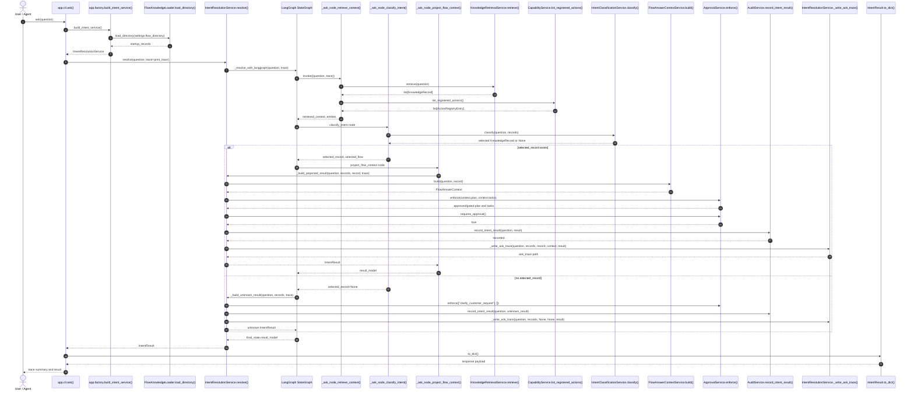
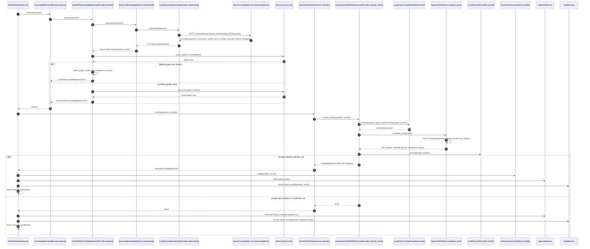

# Ask Sequence Diagrams

## Purpose
Show which classes and methods are invoked from the moment a user runs `ask` until the platform returns an intent result.

The diagrams use Mermaid sequence syntax so they can be rendered by GitHub and most Markdown tools.

## Diagram 1: CLI `ask` To Final Intent Result

This diagram shows the main successful path when `python -m app.cli ask "..."` or `make ask` is used. The service runs LangGraph ask orchestration, and the graph nodes call retrieval, classification, projection, approval, audit, and trace-writing methods.

## Diagram 2: GraphRAG Retrieval And LLM Model Decision

This diagram zooms into the AI provider path used when `USE_AI_PROVIDERS=true`. The question is expanded for graph search, Neo4j returns candidate graph rows, LangChain formats the prompt, and the OpenAI-compatible chat completion endpoint returns the constrained JSON decision.

## Main Classes And Methods

| Step | Class / Function | Method | Responsibility |
| --- | --- | --- | --- |
| CLI entry | `app.cli` | `ask()` | Receives the question and prints trace/result. |
| Composition | `app.factory` | `build_intent_service()` | Wires LLM, GraphRAG, Neo4j, approval, audit, and flow context providers into `IntentResolutionService`. |
| Resolution | `IntentResolutionService` | `resolve()` | Starts LangGraph ask orchestration. |
| Orchestration | `IntentResolutionService` | `_resolve_with_langgraph()` | Builds and runs the ask workflow nodes. |
| Retrieval node | `IntentResolutionService` | `_ask_node_retrieve_context()` | Calls retrieval and action registry lookup. |
| Classification node | `IntentResolutionService` | `_ask_node_classify_intent()` | Calls the intent classifier and stores selected flow state. |
| Projection node | `IntentResolutionService` | `_ask_node_project_flow_context()` | Builds the resolved answer from selected flow context. |
| Retrieval service | `KnowledgeRetrievalService` | `retrieve()` | Delegates retrieval to the configured provider. |
| Graph retrieval | `GraphRAGKnowledgeRetrievalProvider` | `retrieve()` | Uses query understanding and Neo4j graph rows to create candidates. |
| Query understanding | `QueryUnderstandingService` | `understand()` | Delegates query expansion to the LLM provider. |
| LLM query expansion | `LLMQueryUnderstandingProvider` | `understand()` | Corrects typos, expands search terms, proposes possible intent hints, and detects ambiguity using an LLM. |
| Intent classifier | `IntentClassificationService` | `classify()` | Delegates classification to the configured reasoning provider. |
| LLM reasoning | `LangchainGraphRAGReasoningProvider` | `classify_intent()` | Builds constrained prompt and selects an existing flow or unknown. |
| Model client | `OpenAIJSONClient` | `complete_json()` | Calls OpenAI-compatible `/chat/completions` and parses JSON. |
| Flow context | `FlowAnswerContextService` | `build()` | Projects ingested event, plan, tasks, actions, and ontology. |
| Approval | `ApprovalService` | `enforce()` / `requires_approval()` | Applies human approval policy. |
| Audit | `AuditService` | `record_intent_result()` | Records the final intent event. |
| Trace | `IntentResolutionService` | `_write_ask_trace()` | Writes debug trace JSON for the ask operation. |
